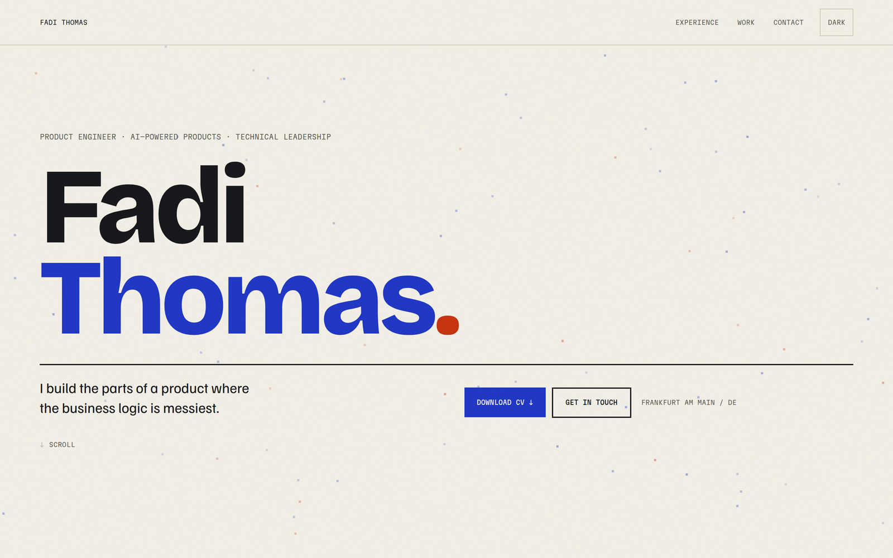

# fadiamg.github.io

Personal portfolio site — **[fadiamg.github.io](https://fadiamg.github.io)**

Static Next.js site, deployed to GitHub Pages automatically on every push to `main`.
Content lives in one data file, so updating the site means editing text, not components.



---

## Stack

| | |
|---|---|
| Framework | Next.js 16 (App Router, Turbopack) |
| Language | TypeScript |
| Styling | Tailwind CSS v4 |
| Animation | Motion, anime.js |
| Fonts | Bricolage Grotesque, Familjen Grotesk, Martian Mono (`next/font`) |
| Output | Static export (`output: "export"`) — no server, no runtime |
| Hosting | GitHub Pages via GitHub Actions |

---

## Running locally

```bash
npm install
npm run dev      # http://localhost:3000
```

```bash
npm run build    # production build + static export → out/
npm run lint     # eslint
npx tsc --noEmit # typecheck
```

Node 22+ recommended (the deploy workflow pins 22).

---

## Languages

The site ships in English at `/` and German at `/de/`, each statically built
with its own `<html lang>` and reciprocal `hreflang` tags.

- `src/data/resume.ts` — CV content, English. Still the single editing surface.
- `src/data/content.en.ts` / `content.de.ts` — one object per locale.
- `src/data/types.ts` — the shape both must satisfy. Because both are typed
  against it, dropping a field in one language fails the build rather than
  shipping a half-translated page.
- `src/lib/locale.tsx` — provider and `useLocale()`; components read content
  from here rather than importing it.

> **The German has not been reviewed by a native speaker.** It was written by
> Claude. Professional German fails in ways that are invisible to a non-native
> author — register, false friends, phrasing that reads as translated — and the
> audience for `/de/` is German employers. Get it read by a native speaker
> before relying on it in applications.

> **Both locales currently serve the same English CV PDF.** The German page
> says "Lebenslauf laden" and hands over an English document. Point
> `cvPath` in `content.de.ts` at a German CV when you have one.

## Making it yours

Almost everything is data, not markup.

### Content

All copy lives in [`src/data/resume.ts`](src/data/resume.ts):

```ts
identity   // name, positioning line, location, hook, links
profile    // the "about" lead and paragraphs
focusAreas // the three-column capability grid
experience // roles, dates, bullet points
projects   // selected work
skills     // grouped technical skills
education  // degrees
```

Edit that file and the whole site follows. No component changes needed.

### Colours and type

Design tokens are CSS custom properties at the top of
[`src/app/globals.css`](src/app/globals.css) — one block for light, one for dark:

```css
--bg      /* page background   */
--fg      /* body text         */
--dim     /* secondary text    */
--ink1    /* primary accent    */
--ink2    /* secondary accent  */
--hair    /* hairline borders  */
```

Change those six values and the entire site re-themes, including dark mode.
Fonts are declared in [`src/lib/fonts.ts`](src/lib/fonts.ts).

### CV

Replace `public/cv/fadi-thomas-cv.pdf`. The filename is referenced in
`Hero.tsx` and `Contact.tsx`; keep it or update both.

> **Check what you're publishing.** Anything in `public/` is served at a
> guessable URL and is fully text-extractable. See [Privacy](#privacy) below.

---

## Project structure

```
src/
  app/
    layout.tsx          root layout, metadata, theme bootstrap
    page.tsx            section composition
    globals.css         design tokens + base styles
    favicon.ico         browser tab icon
    apple-icon.png      iOS home screen icon
    opengraph-image.png social preview card
  components/           one file per section
  data/resume.ts        ← all content lives here
  lib/
    fonts.ts            font loading
    theme.ts            no-flash theme bootstrap script
    motion-preference.ts  respects prefers-reduced-motion
public/
  cv/                   downloadable CV
  .nojekyll             stops GitHub Pages running Jekyll on the output
```

---

## Deployment

[`.github/workflows/deploy.yml`](.github/workflows/deploy.yml) runs on every push
to `main`: `npm ci` → `npm run build` → upload `out/` → deploy to Pages.

**One-time setup:** Settings → Pages → Source → **GitHub Actions**
(*not* "Deploy from a branch" — that ignores the workflow).

The workflow uses least-privilege permissions (`contents: read`, `pages: write`,
`id-token: write`) and holds no secrets.

---

## Privacy

The site is public, so treat everything in it as public.

- **Email is not in the HTML.** It's split across two fields in `resume.ts` and
  reassembled in the browser, so it never appears in the static markup that
  scrapers read.
- **The CV is a different story.** `public/cv/*.pdf` is served at a fixed,
  guessable URL and its text — including any phone number and email in the
  header — extracts in one command. If you don't want a phone number public,
  publish a CV variant without it and keep the full one for direct applications.
- **No secrets, keys, or env files** are tracked, and `.gitignore` covers
  `.env*` and `*.pem`.

---

## Accessibility

- Skip link to main content
- `prefers-reduced-motion` respected throughout (`src/lib/motion-preference.ts`)
- Minimum 44px touch targets on interactive elements
- Theme set before first paint, so there is no flash on load

---

## Roadmap

- [ ] **Per-role variants** — build targeted versions of the site from the same
      content, emphasising different experience per application
- [ ] **Theme presets** — swap the whole palette from one config value
- [ ] **Layout options** — alternative section orders and hero treatments

---

## License

Code is MIT. Content — CV, copy, and personal details — is not; please don't
republish it as your own.
